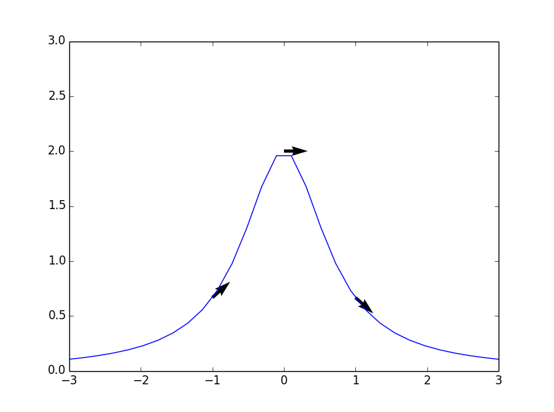
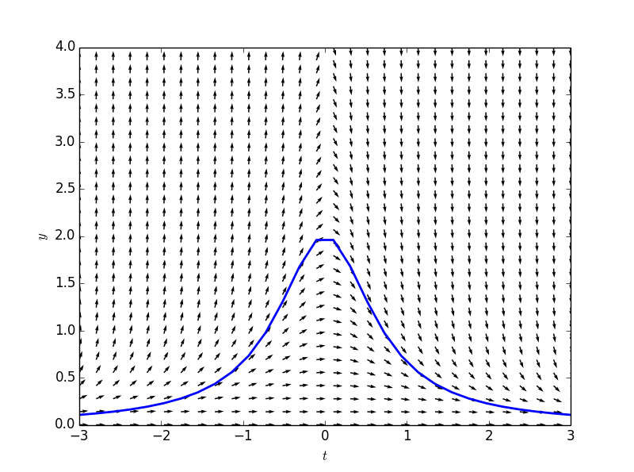

#斜率场
##**斜率场（slope field）**  
微分方程$$\frac{dy}{dt}=f(t,y(t))$$的右边：$$f(t,y(t))$$定义了一个斜率场，即在$$t-y$$平面上的一张可以用来描述该微分方程的图。  

取$$t-y$$平面上的任意一点$$(t_i,y_i)$$，则$$f(t_i,y_i)$$表示的是经过该点的微分方程解在该点处切线的斜率。  


例如之前章节中涉及的微分方程：$$\frac{dy}{dt}=-2ty^2$$  

知道其解形式为：$$y(t) = \frac{1}{t^2+C}$$  
若给定初值$$y(0)=2$$，其解为：$$y(t)=\frac{1}{t^2+\frac{1}{2}}$$  
下面列举该解所经过的几个点，以及相应位置切线的斜率：  

| $$(t,y)$$ |$$ f(t,y)$$ |$$ y'(t) $$|
| -- | -- | -- |
| $$(0,2)$$ | 0 | 0 |
| $$(-1,\frac{2}{3})$$ | $$\frac{8}{9}$$ | $$\frac{8}{9}$$ |
| $$(1,\frac{2}{3})$$ | $$\frac{8}{9}$$ | $$\frac{8}{9}$$ |

绘图表示为：  
```
    # library
    import matplotlib.pyplot as plt
    from sympy.abc import t
    import numpy as np
    
    # define the function 
    y = 1.0/(t**2+1.0/2)
    
    # sample domain
    domain = np.linspace(-3,3,30)
    
    # calculate 3 slopes at tabled position
    T = np.array([-1,0,1])
    Y = np.array([2.0/3,2,2.0/3])
    U = 2
    V = -2*T*Y**2
    N = np.sqrt(U**2+V**2)  
    U2, V2 = U/N, V/N
    
    # make the plot
    plt.plot(domain, [y.subs(t, tval) for tval in domain])
    plt.quiver( T,Y,U2, V2)
    plt.xlim([-3,3])
    plt.ylim([0,3])
```
  

下面是微分方程的斜率场，箭头代表的含义是：取$$t-y$$平面上的一个点，找到经过该点的微分方程的解（函数y(t)），求出该函数在该点处切线的方向，将该方向用箭头表示。

```
    import matplotlib.pyplot as plt
    from sympy.abc import t
    import numpy as np

    f = 1.0/(t**2+1.0/2)
    domain = np.linspace(-3,3,30)
    
    T,Y = np.meshgrid(domain,np.linspace(0,4,30) )
    U = 1
    V = -2*T*Y**2
    N = np.sqrt(U**2+V**2)  
    U2, V2 = U/N, V/N
    
    fig = plt.figure(num=1)
    ax=fig.add_subplot(111)
    ax.quiver( T,Y,U2, V2)
    plt.plot(domain,np.array([f.subs(t, tval) for tval in domain]), linewidth= 2)
    plt.xlim([-3,3])
    plt.ylim([0,4])
    plt.xlabel(r"$x$")
    plt.ylabel(r"$y$")
    plt.show()
```
    
