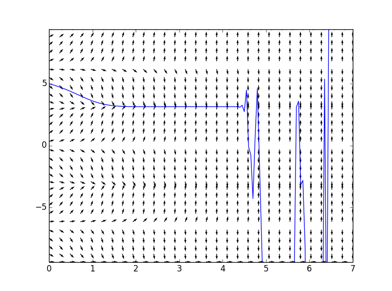

#欧拉方法  
给定一个微分方程和初值：
$$\frac{dy}{dt}=f(t,y(t)),\qquad y(t_0)=y_0$$  

在不求解的前提下，想要获得一个近似解，最简单的方法之一是欧拉方法。  
欧拉方法中，我们设定一个**步长（step size）**$$\delta t$$，依据[线性近似的公式](http://ryancheunggit.gitbooks.io/calculus-with-python/content/07Derivative.html)：  
$$y(t_{i+1})=y(t_i + \Delta t)=y(t_{i})+\frac{dy}{dt}\bigg|_{t=t_i}\Delta t+O({\Delta t}^2)\\
\qquad \approx y(t_i)+y'(t_i)\Delta t$$  
迭代地获得近似解。  

举例： 
$$\frac{dy}{dt}=y^2-t, \qquad y(0)=0,\qquad \Delta t = 0.5$$   

Python中定义欧拉方法：
```
    import sympy
    from sympy.abc import t
    from sympy import Function
    y = Function('y')
    formula = y(t)**2-t

    def eulerMethod(formula,tval,yval,step,numSteps,percision = 5):
        tvals = [tval]
        yvals = [yval]
        for i in range(numSteps):
            m = round(formula.subs({y(t):yvals[-1],t:tvals[-1]}),percision)
            tvals.append(round(tvals[-1]+step,percision))
            yvals.append(round(yvals[-1]+m*step,percision))
        return tvals, yvals

    tv,yv = eulerMethod(formula, -1.0, -0.5,0.5,4)
    for i in range(len(tv)):
        print "after step {0} the t value is {1} and y value is\
        {2}".format(str(i),str(tv[i]),str(yv[i]))
    
    # output is :
    # after step 0 the t value is -1.0 and     y value is -0.5
    # after step 1 the t value is -0.5 and     y value is 0.125000000000000
    # after step 2 the t value is 0.0 and     y value is 0.382812500000000
    # after step 3 the t value is 0.5 and     y value is 0.456085205078125
    # after step 4 the t value is 1.0 and     y value is 0.310092062223703
```
欧拉方法的精确地取决于：
    1. 微分方程本身  
    2. 步长  

欧拉方法是最基本的**定步长（fixed-step-size）**数值近似方法，$$\Delta$$为常数，是一个**一阶算法（first-order algorithm）**: $$\text{error}\leq C\cdot (\Delta)^1$$，通常，如果步长减半，通常误差也会减半。  

欧拉方法之外还有很多计算更简便却精度更好的算法，例如Runge-Kutta方法，经典的RK方法是4阶的，意思是，如果步长减半，误差通常会减小为$$\frac{1}{2^4}$$。  

定步长方法并不总是适用于所有情况，例如:
$$\frac{dy}{dt}=e^{t}siny,\qquad y(0)=5$$
随着$$t$$值得增加，$$y(t)$$实际上应该是进入平衡，而非上下震动。  

```
    import numpy as np
    tdomain = np.linspace(0,7,30)
    ydomain = np.linspace(-3*np.pi,3*np.pi,30)
    tval = 0
    yval = 5
    
    formula = sympy.E**(t)*sympy.sin(y(t))
    
    def plotEulerAndSF(formula,tval,yval,step, tdomain, ydomain,percision=5):
        fig = plt.figure(num=1)
        numIter = int(float(tdomain[-1]-tdomain[0])/step)
        tv,yv = eulerMethod(formula, tval, yval ,step, numIter,percision)
            
        T,Y = np.meshgrid(tdomain,ydomain)
        U = 1
        V = np.array([[formula.subs({y(t): yval, t: tval}) for tval in\
                      tdomain] for yval in ydomain],dtype = 'float')
        N = np.sqrt(U**2+V**2)
        U2, V2 = U/N, V/N
        plt.quiver( T,Y,U2, V2)
        plt.plot(tv,yv)
        plt.xlim([tdomain[0],tdomain[-1]])
        plt.ylim([ydomain[0],ydomain[-1]])
        
        return fig
        
    fg = plotEulerAndSF(formula, tval, yval, 0.05, tdomain, ydomain)
    fg.show()
```



