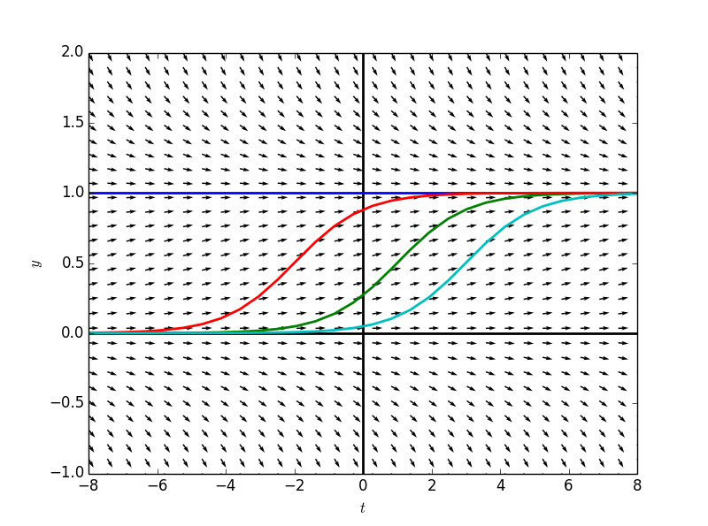
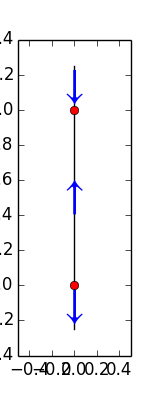
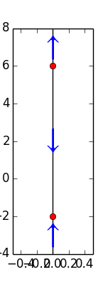
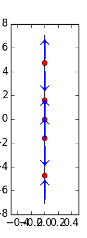

#自治微分方程

自治微分方程指的是$$\frac{dy}{dt}=f(t,y(t))$$的右边是只包含$$y$$的函数的微分方程。例如前面章节出现的人口增长模型。    

任何自治微分方程都是变量课分离的，但是积分可能会很困难。    

给定一个自治微分方程的解，将其沿着水平方向横移，我们可以获得很多组不同的解。   

例如之前也出现过的$$\frac{dy}{dt}=y(1-y)$$    

    

对于自治微分方程，斜率场中的冗余信息太多，用**相线（phase line）**来简洁地表示这些信息。  

微分方程$$\frac{dy}{dt}=y(1-y)$$的平衡解为$$y(t)=0$$和$$y(t)=1$$    
1. 在$$y>1$$的区域，$$\frac{dy}{dt}<0$$，即形为$$y(t_0)=y_0, y_0 >1$$的初值问题，随着$$t$$的增加，函数值终会收敛于$$y(t)=1$$    
2. 在$$y<0$$的区域，$$\frac{dy}{dt}<0$$，即形为$$y(t_0)=y_0, y_0 <0$$的初值问题，随着$$t$$的增加，函数值终会收敛于$$y(t)=-\infty$$  
3. 在$$0<y<1$$的区域,$$\frac{dy}{dt}>0$$,即形为$$y(t_0)=y_0, 0<y_0 <1$$的初值问题，，随着$$t$$的增加，函数值终会收敛于$$y(t)=1$$    

用一根直线表示$$y(t)$$的值，用点表示平衡解，用箭头表示各个区域的初值问题，随着$$t$$的增加，$$y(t)$$值的走向：
```
    import sympy
    from sympy.abc import t
    from sympy import Function, Derivative, dsolve, Eq, solve
    
    def phaseLine(formula):
    
        solutions = solve(Eq(formula,0),y(t))
        solutions.sort()
        ran = solutions[-1]-solutions[0]
        ydomain = np.linspace(float(solutions[0]-0.25*ran), float(solutions[-1]+0.25*ran))
    
        fig = plt.figure(num=1)
        plt.plot([0 for dummy in ydomain],ydomain, color = 'black')
        plt.plot([0 for dummy in solutions], solutions, 'or')
        plt.axis(xmin = -0.5, xmax = 0.5)
    
        intervals = [float(solutions[0]-0.25*ran)]+solutions+[float(solutions[-1]+0.25*ran)]
        for i in range(len(intervals)-1):
            midpoint = (intervals[i]+intervals[i+1])/2.0
            intervalSign = sign(formula.evalf(subs={'y(t)':midpoint}))
            if intervalSign == -1:
                plt.text(0, midpoint, u'\u2193',fontname='STIXGeneral', color = 'blue', size=30, va='center', ha='center', clip_on=True)
            elif intervalSign == 1:
                plt.text(0, midpoint, u'\u2191',fontname='STIXGeneral', color = 'blue', size=30, va='center', ha='center', clip_on=True)
    
        return fig
    
    y = Function('y')
    formula = y(t)*(1-y(t))
    fg = phaseLine(formula)
    fg.show()
```


练习：画出$$\frac{dy}{dt}=y^2-4y-12$$的相线  
```
    formula = y(t)**2 - 4*y(t) - 12
    fg2 = phaseLine(formula)
    fg2.show()
```
   

练习：画出$$\frac{dy}{dt}=3y^3-12y^2$$的相线  

```
    formula = 3*y(t)**3-12*y(t)**2
    fg3 = phaseLine(formula)
    fg3.show()
```
   


#