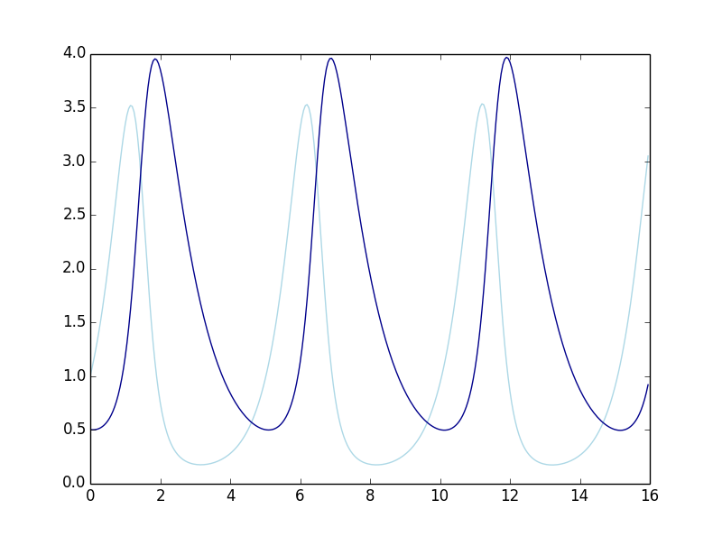
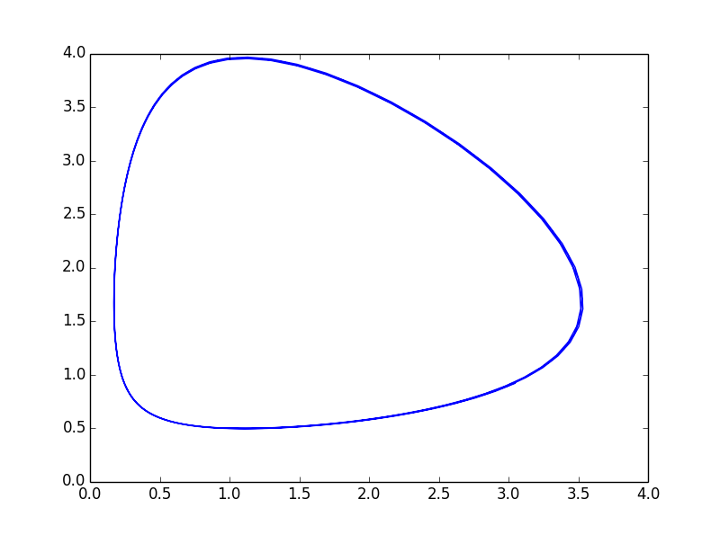
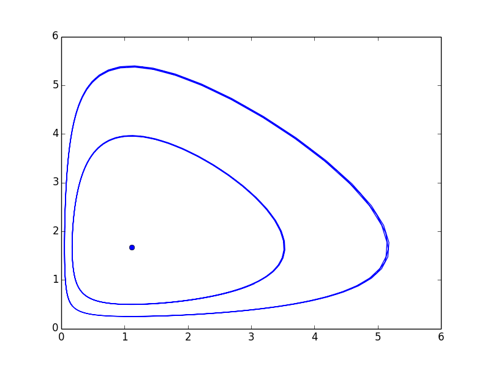
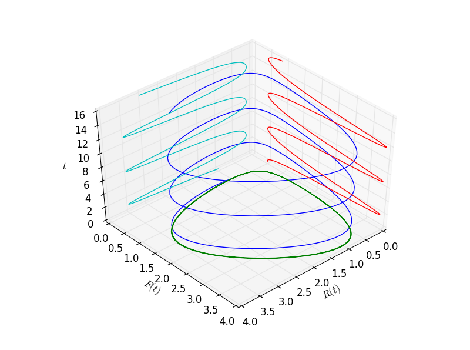
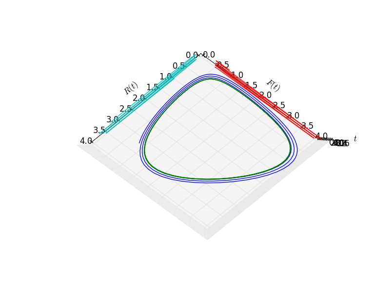
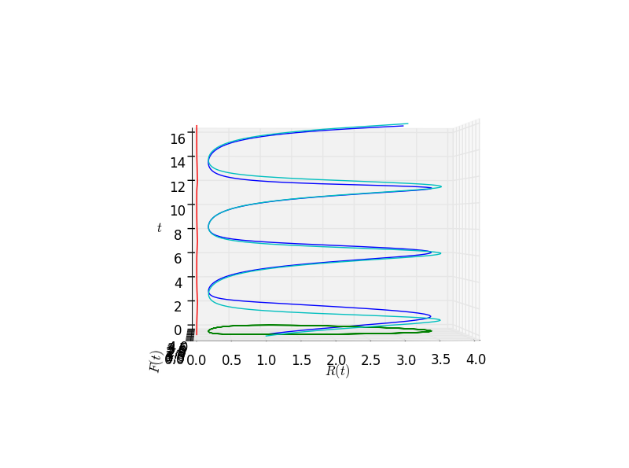

# 微分方程组

## 弹簧-重物系统（Mass-Spring System） 
假设有一个弹簧垂直挂在一个水平面下，现在给弹簧下方挂上一个重物。由牛顿第二定律有：  
弹簧的拉力 = 挂着重物的质量 * 重物的加速度 $$F = ma = m \frac{d^2y}{dt^2}$$  
又由胡可定律：
弹簧的拉力 = 系数 * 弹簧的位置变化 $$F = -ky$$

令两者相等有：
$$m\frac{d^2y}{dt^2} = -ky\\
m\frac{d^2y}{dt^2} + ky = 0$$

这是一个二阶（二阶导数）自治（只有y没有t）微分方程

一般而言二阶自治微分方程包括：
1. 一个自变量
2. 一个因变量
3. 方程形式为：$$\frac{d^2y}{dt^2} = f(x, \frac{dy}{dt})$$   

再有两个二阶自治方程的例子：
范德波尔方程（van der pol ）：
$$\frac{d^2x}{dt^2} - (1-x^2)\frac{dx}{dt} + x = 0$$
达芬方程（duffing）：
$$\frac{d^2x}{dt^2} + b\frac{dx}{dt} + kx + x^3= 0$$

## 狐狸-兔子模型
开始进入一阶方程组的讨论。我们用最简单的捕猎（predator-prey）系统。假设捕食者是狐狸，猎物是兔子。

前提假设如下：  
1. 如果没有狐狸，兔子的繁殖率与其当前数量成正比，并且没有上限  
2. 如果没有兔子，狐狸的死亡率与其当前数量成正比  
3. (兔子被狐狸吃掉的频率)与(狐狸与兔子相遇的频率)成正比  
3. (狐狸繁殖率)与(兔子被捕杀的数量)成正比，即与(狐狸与兔子相遇的频率)成正比  

变量：
+ 自变量：时间 $$t$$
+ 因变量：兔子的数量 $$R$$， 狐狸的数量 $$F$$  

根据前提假设1,3：
$$\frac{dR}{dt} = aR - bRF$$   
根据前提假设2,4：
$$\frac{dF}{dt} = - cF + dRF$$  

两个方程一起，我们获得了方程组：
$$\frac{dR}{dt} = aR - bRF$$   
$$\frac{dF}{dt} = - cF + dRF$$  

其中参数$$a,b,c,d$$都是正数

上面的例子是一个一般一阶自治微分方程组，一般而言，一个一阶自治方程组包括：
1. 一个自变量  
2. 两个因变量  
3. 形式为:$$\begin{cases} \frac{dx}{dt} = f(x,y) \\ \frac{dy}{dt} = g(x,y) \end{cases}$$

平衡解是两个函数$$R(t),F(t)$$使得方程组中两个方程永远成立。
$$\begin{cases} aR - bRF = R(a-bF) = 0 \\ - cF + dRF = F(dR - c) = 0 \end{cases}$$  
得出两个平衡解：
$$\begin{cases} R(t) = 0 \\ F(t) = 0 \end{cases}$$
以及：
$$\begin{cases} R(t) = \frac{c}{d} \\ F(t) = \frac{a}{b} \end{cases}$$

回到我们的捕猎方程组，考虑一个具体问题，令参数如下：
$$a = 2, b = 1.2, c = 1, d = 0.9$$
$$\frac{dR}{dt} = 2R - 1.2RF$$
$$\frac{dF}{dt} = - F + 0.9RF$$
不难发现有两组平衡解：$$(R(t),F(t) = (0,0)$$和$$(R(t),F(t))=(10/9,5/3)$$，若在$$R-F$$平面，称为**相位平面(Phase Plane)**

现在假设初值为:$$(R_0, F_0) = (1.0, 0.5)$$  
用数值近似方法看一下$$R(t)$$和$$F(t)$$的表现：

```
	import numpy as np
	import sympy
	from sympy.abc import t
	from sympy import Function, Derivative, dsolve, Eq
	import matplotlib.pyplot as plt

	def reduceSize(Range, p):
	    return [Range[i] for i in range(len(Range)) if i%p == 0]

	R = Function('R')
	F = Function('F')

	formulaR = 2*R(t) - 1.2*R(t)*F(t)
	formulaF = -1*F(t) + 0.9*R(t)*F(t)

	tdomain = np.array([i*0.0005 for i in range(32000)])
	dt = 0.0005
	Rrange = [1.0]
	Frange = [0.5]

	for t in tdomain[1:]:
    dR = formulaR.subs({'R(t)':Rrange[-1] , 'F(t)': Frange[-1]})
    dF = formulaF.subs({'R(t)':Rrange[-1] , 'F(t)': Frange[-1]})
    Rrange.append(Rrange[-1]+dt*dR)
    Frange.append(Frange[-1]+dt*dF)

    Trange = reduceSize(tdomain, 100)
	Rrange = reduceSize(Rrange, 100)
	Frange = reduceSize(Frange, 100)

	plt.plot(Trange,Rrange, 'lightblue',Trange,Frange, 'darkblue')
```

兔子的数量是淡蓝色的曲线，狐狸的数量是深蓝色的曲线，发现两者都是在上下震荡着。上面这个图称为**成分图（component graph）**

看一看相位平面
```
	plt.plot(Rrange, Frange)	
```


横轴是兔子的数量，纵轴是狐狸的数量。在相位平面的这个曲线，被称为**解曲线(solution curve)**

不同的初值，对应于相位平面内不同的解曲线，在同一个相位平面内，将方程组的多个解曲线绘制而出就成了**相位图（phase portrait）**

```
	Rrange2 = [1.0]
	Frange2 = [0.25]
	for t in tdomain[1:]:
	    dR = formulaR.subs({'R(t)':Rrange2[-1] , 'F(t)': Frange2[-1]})
	    dF = formulaF.subs({'R(t)':Rrange2[-1] , 'F(t)': Frange2[-1]})
	    Rrange2.append(Rrange2[-1]+dt*dR)
	    Frange2.append(Frange2[-1]+dt*dF)

	Rrange3 = [10.0/9]
	Frange3 = [5.0/3]

	plt.plot(Rrange, Frange, 'blue',
	         Rrange2, Frange2, 'blue',
	         Rrange3, Frange3, 'bo')
```


3D 交互图！ 拖动起来反应比较慢，比不上老师matlab里的图。
```
	fig = plt.figure()
	ax = fig.gca(projection='3d')
	ax.plot(Rrange, Frange, Trange)
	ax.plot(Rrange, Frange, [0 for t in Trange])
	ax.plot([0 for t in Trange], Frange, Trange)
	ax.plot(Rrange, [0 for t in Trange], Trange)
	ax.set_xlabel(r'$R(t)$')
	ax.set_ylabel(r'$F(t)$')
	ax.set_zlabel(r'$t$')
	plt.show()
```


从上往下看$$R-F$$平面


换一个角度看$$R(t),F(t)$$随$$t$$的变化


本节开头引入的弹簧-重物系统$$m\frac{d^2y}{dt^2} + ky = 0$$虽然是一个单一的二阶微分方程，但是如果我们引入$$\frac{dy}{dt} = v$$便可获得一个微分方程组：

$$\frac{dy}{dt} = v$$
$$\frac{dv}{dt} = -\frac{k}{m}y$$
成为一个一阶方程组，这种方法称为降阶法。

弹簧-重物系统与我们的捕猎系统不同的一点在于：我们可以找到弹簧-重物系统的公式解，而无法找出捕猎系统的公式解。
考虑一个特殊情况，令$$k=m$$，则弹簧-重物系统简化为：
$$\frac{dy}{dt} = v$$
$$\frac{dv}{dt} = -y$$
下面这些函数都是该系统的解之一
$$y_1(t)=sint, y_2(t)=2sint, y_3(t)=cost$$    


