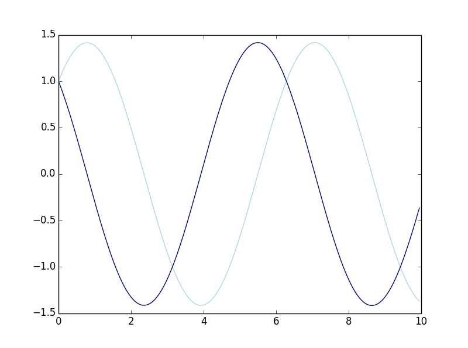
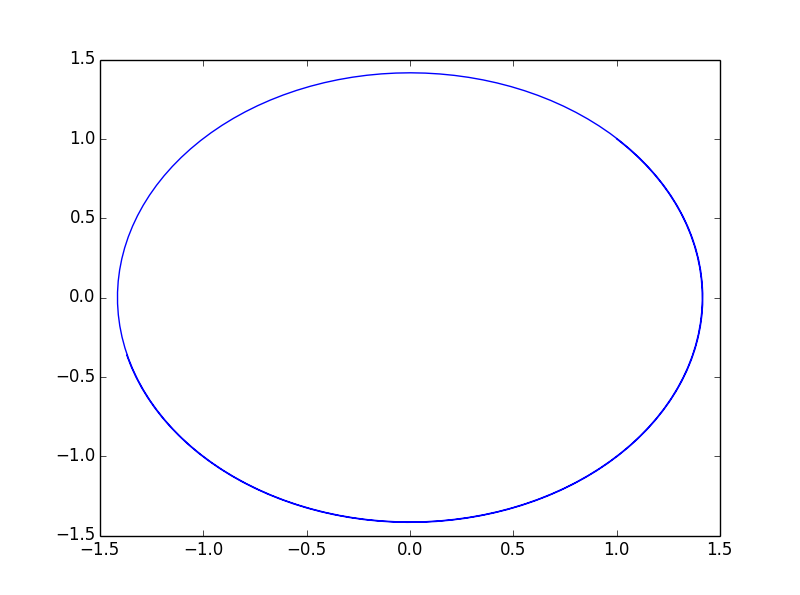

## 向量场  
回顾上节的弹簧-重物系统的一个具体例子： 
$$\begin{cases} \frac{dy}{dt} = v\\ \frac{dv}{dt} = -y \end{cases}$$  

看一下上面微分方程组的表现：

```
    import numpy as np
    import sympy
    from sympy.abc import t
    from sympy import Function, Derivative, dsolve, Eq
    import matplotlib.pyplot as plt
    import matplotlib as mpl
    from mpl_toolkits.mplot3d import Axes3D
    
    
    def numericalApproxForTwo(fR, fF, R0, F0, dt = 0.0005, steps = 300):
        def reduceSize(Range, p):
            return [Range[i] for i in range(len(Range)) if i%p == 0]
    
        tdomain = np.array([i*dt for i in range(steps)])
    
        Frange = [F0]
        Rrange = [R0]
    
        for t in tdomain[1:]:
            dR = fR.subs({'R(t)':Rrange[-1] , 'F(t)': Frange[-1]})
            dF = fF.subs({'R(t)':Rrange[-1] , 'F(t)': Frange[-1]})
            Rrange.append(Rrange[-1]+dt*dR)
            Frange.append(Frange[-1]+dt*dF)
    
        Trange = reduceSize(tdomain, 100)
        Rrange = reduceSize(Rrange, 100)
        Frange = reduceSize(Frange, 100)
    
        return Trange, Rrange, Frange
    
    R = Function('R')
    F = Function('F')
    
    formulaR = F(t)
    formulaF = -1*R(t)
    
    Tvals,Rvals,Fvals = numericalApproxForTwo(formulaR, formulaF, 1.0, 1.0, dt = 0.0005, steps = 12500)
    
    # component graph!
    plt.plot(Tvals,Rvals, 'lightblue',Tvals,Fvals, 'darkblue')
    
    # solution curve in phase plane
    plt.plot(Rvals, Fvals)
```




如果用向量表示法来看该微分方程系统。
令向量$$Y(t)=\begin{pmatrix} y(t)\\v(t) \end{pmatrix}$$    
想象一个$$y-v$$平面，给定一个$$t$$值，$$Y(t)$$则对应的是平面中的一点。对其求导获得$$\frac{dY}{dt} = \begin{pmatrix} \frac{dy}{dt} \\ \frac{dv}{dt} \end{pmatrix}$$，为微分方程组的左边。   
令$$F$$是向量$$Y$$的一个函数，且$$F(Y) = F(\begin{pmatrix} y \\ v \end{pmatrix}) = \begin{pmatrix} v \\ -y \end{pmatrix}$$，为微分方程组的右边。   
因而可以将原微分方程组改写为：$$\frac{dY}{dt} = F(Y)$$，即将一个原本为两个标量的微分方程组，变成了一个向量的微分方程。

用导数的“随着输入的微小变化，输出所相应的变化”理解来看，上面方程$$\frac{dY}{dt} = F(Y)$$描述的是，随着$$t$$的微小变化，$$y-v$$平面中位置的相应变化。

据几个具体点，计算其导数：
$$F(\begin{pmatrix} 1\\0 \end{pmatrix}) = \begin{pmatrix}0\\-1\end{pmatrix}$$  
$$F(\begin{pmatrix} 0\\1 \end{pmatrix}) = \begin{pmatrix}1\\0\end{pmatrix}$$  
$$F(\begin{pmatrix} -1\\-1 \end{pmatrix}) = \begin{pmatrix}-1\\0\end{pmatrix}$$  
导数的结果也是向量，且长度根据输入值得不同而不同。在$$y-v$$平面上绘制出不同位置出的导数所代表的向量，获得**向量场(Vector Field)**:


如果只考虑向量的方向，我们获得的便是**方向场(Direction Field)**：
```
    def directionField(fR, fF, Rdomain, Fdomain):
        fig = plt.figure(num=1)
        Rvals,Fvals = np.meshgrid(Rdomain,Fdomain)
        r = np.array([[fR.subs({'R(t)':rval, 'F(t)':fval}) for rval in Rdomain] for fval in Fdomain],dtype = 'float')
        f = np.array([[fF.subs({'R(t)':rval, 'F(t)':fval}) for rval in Rdomain] for fval in Fdomain],dtype = 'float')
        n = np.sqrt(r**2+f**2)
        r, f = r/n, f/n
        plt.quiver(Rvals, Fvals, r, f)
        plt.xlabel(r"$R$")
        plt.ylabel(r"$F$")
        plt.axhline(0,0,1,linewidth = 2, color = 'black')
        plt.axvline(0,0,1,linewidth = 2, color = 'black')
        return fig
    
    R = Function('R')
    F = Function('F')
    
    formulaR = F(t)
    formulaF = -1*R(t)
    
    Rdomain = np.linspace(-3,3,30)
    Fdomain = np.linspace(-3,3,30)
    
    fg1 = directionField(formulaR, formulaF,Rdomain, Fdomain)
    fg1.show()
```


