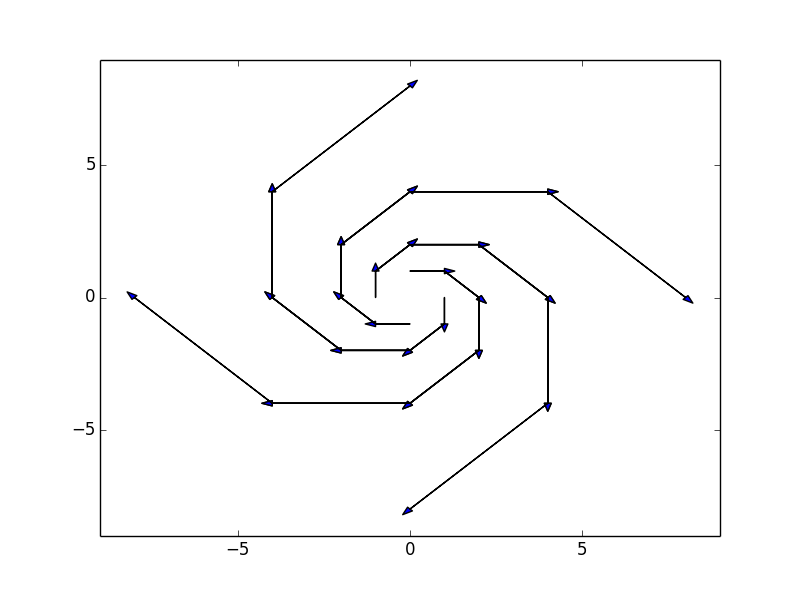
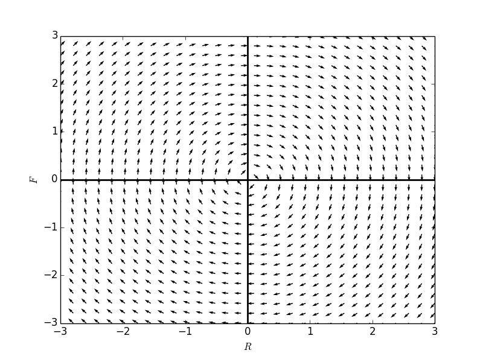
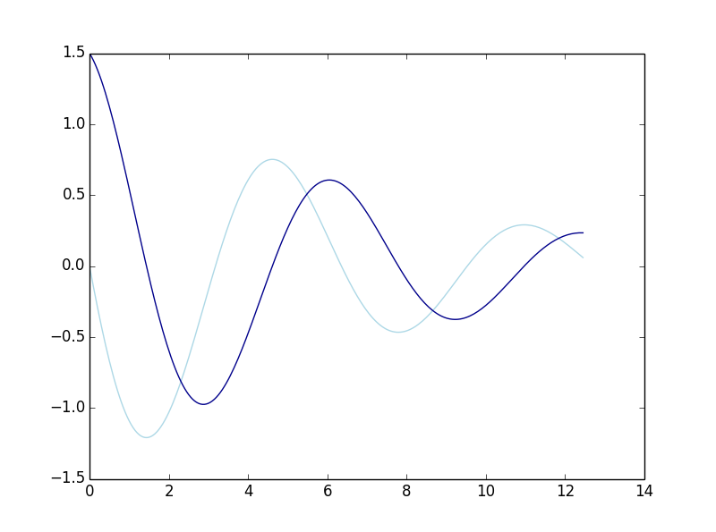
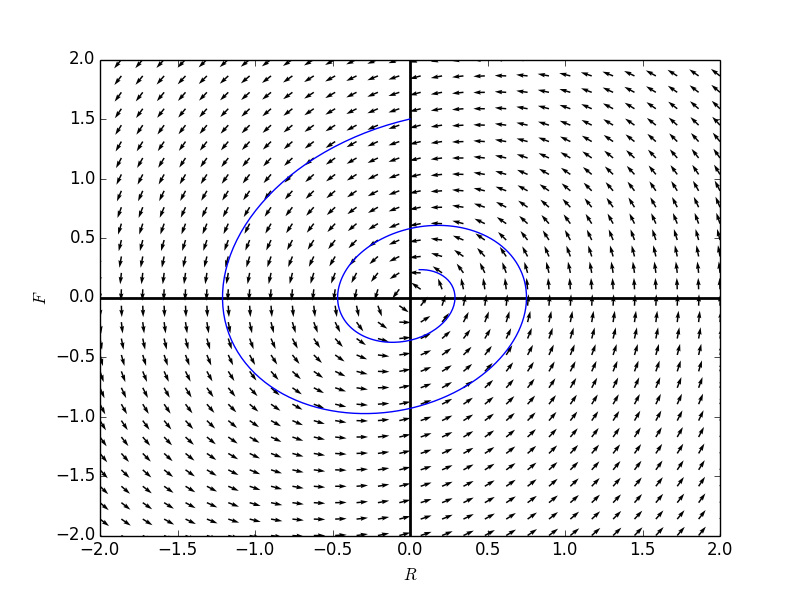
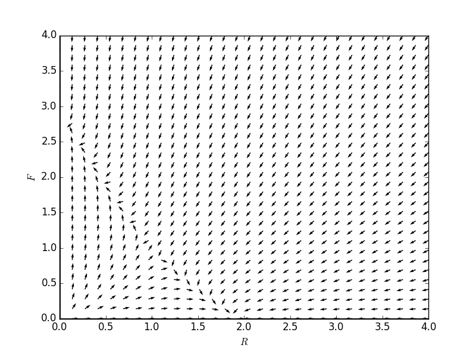
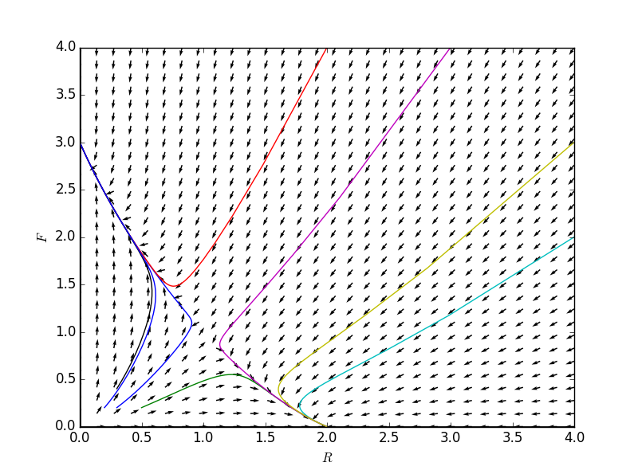

    ## 向量场  
回顾上节的弹簧-重物系统的一个具体例子： 
$$\begin{cases} \frac{dy}{dt} = v \\ \frac{dv}{dt} = -y \end{cases}$$  

看一下上面微分方程组的表现：

```
    import numpy as np
    import sympy
    from sympy.abc import t
    from sympy import Function, Derivative, dsolve, Eq
    import matplotlib.pyplot as plt
    import matplotlib as mpl
    from mpl_toolkits.mplot3d import Axes3D
    
    
    def numericalApproxForTwo(fR, fF, R0, F0, dt = 0.0005, steps = 300):
        def reduceSize(Range, p):
            return [Range[i] for i in range(len(Range)) if i%p == 0]
    
        tdomain = np.array([i*dt for i in range(steps)])
    
        Frange = [F0]
        Rrange = [R0]
    
        for t in tdomain[1:]:
            dR = fR.subs({'R(t)':Rrange[-1] , 'F(t)': Frange[-1]})
            dF = fF.subs({'R(t)':Rrange[-1] , 'F(t)': Frange[-1]})
            Rrange.append(Rrange[-1]+dt*dR)
            Frange.append(Frange[-1]+dt*dF)
    
        Trange = reduceSize(tdomain, 100)
        Rrange = reduceSize(Rrange, 100)
        Frange = reduceSize(Frange, 100)
    
        return Trange, Rrange, Frange
    
    R = Function('R')
    F = Function('F')
    
    formulaR = F(t)
    formulaF = -1*R(t)
    
    Tvals,Rvals,Fvals = numericalApproxForTwo(formulaR, formulaF, 1.0, 1.0, dt = 0.0005, steps = 20000)
    
    # component graph!
    plt.plot(Tvals,Rvals, 'lightblue',Tvals,Fvals, 'darkblue')
    
    # solution curve in phase plane
    plt.plot(Rvals, Fvals)
```


如果用向量表示法来看该微分方程系统。
令向量$$Y(t)=\begin{pmatrix} y(t)\\v(t) \end{pmatrix}$$    
想象一个$$y-v$$平面，给定一个$$t$$值，$$Y(t)$$则对应的是平面中的一点。对其求导获得$$\frac{dY}{dt} = \begin{pmatrix} \frac{dy}{dt} \\ \frac{dv}{dt} \end{pmatrix}$$，为微分方程组的左边。   
令$$F$$是向量$$Y$$的一个函数，且$$F(Y) = F(\begin{pmatrix} y \\ v \end{pmatrix}) = \begin{pmatrix} v \\ -y \end{pmatrix}$$，为微分方程组的右边。   
因而可以将原微分方程组改写为：$$\frac{dY}{dt} = F(Y)$$，即将一个原本为两个标量的微分方程组，变成了一个向量的微分方程。

用导数的“随着输入的微小变化，输出所相应的变化”理解来看，上面方程$$\frac{dY}{dt} = F(Y)$$描述的是，随着$$t$$的微小变化，$$y-v$$平面中位置的相应变化。

据几个具体点，计算其导数：
$$F(\begin{pmatrix} 1\\0 \end{pmatrix}) = \begin{pmatrix}0\\-1\end{pmatrix}$$  
$$F(\begin{pmatrix} 0\\1 \end{pmatrix}) = \begin{pmatrix}1\\0\end{pmatrix}$$  
$$F(\begin{pmatrix} -1\\-1 \end{pmatrix}) = \begin{pmatrix}-1\\0\end{pmatrix}$$  
导数的结果也是向量，且长度根据输入值得不同而不同。在$$y-v$$平面上绘制出不同位置出的导数所代表的向量，获得**向量场(Vector Field)**:

```
    def vectorField(fR, fF, Rdomain, Fdomain, points = [], steps = 5):
        fig = plt.figure(num=1)
        colors = ['red', 'green', 'blue', 'orange', 'black']
        for i, point in enumerate(points):
            Rvals, Fvals, r,f = [], [], [], []
            pr, pf = point[0], point[1]
            for step in range(steps):
                Rvals.append(pr)
                Fvals.append(pf)
                r.append(int(fR.subs({'R(t)': Rvals[-1], 'F(t)':Fvals[-1]})))
                f.append(int(fF.subs({'R(t)': Rvals[-1], 'F(t)':Fvals[-1]})))
                pr, pf = pr+r[-1], pf+f[-1]
                plt.arrow(Rvals[-1],Fvals[-1],r[-1],f[-1], head_width = 0.2)
        plt.xlim([Rdomain[0],Rdomain[-1]])
        plt.ylim([Fdomain[0],Fdomain[-1]])
        return fig
    
    R = Function('R')
    F = Function('F')
    
    formulaR = F(t)
    formulaF = -1*R(t)
    
    Rdomain = np.linspace(-9,9,30)
    Fdomain = np.linspace(-9,9,30)
    
    fg2 = vectorField(formulaR, formulaF, Rdomain, Fdomain, points = [(0,1),(1,1),(1,0),(1,-1),(0,-1),(-1,-1),(-1,0),(-1,1)], steps = 5)
```


如果只考虑向量的方向(均标准化为同样的长度)，绘制出的便是**方向场(Direction Field)**：
```
    def directionField(fR, fF, Rdomain, Fdomain):
        fig = plt.figure(num=1)
        Rvals,Fvals = np.meshgrid(Rdomain,Fdomain)
        r = np.array([[fR.subs({'R(t)':rval, 'F(t)':fval}) for rval in Rdomain] for fval in Fdomain],dtype = 'float')
        f = np.array([[fF.subs({'R(t)':rval, 'F(t)':fval}) for rval in Rdomain] for fval in Fdomain],dtype = 'float')
        n = np.sqrt(r**2+f**2)
        r, f = r/n, f/n
        plt.quiver(Rvals, Fvals, r, f)
        plt.xlabel(r"$R$")
        plt.ylabel(r"$F$")
        plt.axhline(0,0,1,linewidth = 2, color = 'black')
        plt.axvline(0,0,1,linewidth = 2, color = 'black')
        return fig
    
    R = Function('R')
    F = Function('F')
    
    formulaR = F(t)
    formulaF = -1*R(t)
    
    Rdomain = np.linspace(-3,3,30)
    Fdomain = np.linspace(-3,3,30)
    
    fg1 = directionField(formulaR, formulaF,Rdomain, Fdomain)
    fg1.show()
```


## 自治方程组的向量表示

考虑一个方程组：
$$\begin{cases} \frac{dx}{dt} = f(x,y) \\ \frac{dy}{dt} = g(x,y) \end{cases}$$  
根据微分方程组的右边定义一个向量场：
$$F(\begin{pmatrix} x \\ y \end{pmatrix}) = \begin{pmatrix} f(x,y) \\ g(x,y) \end{pmatrix}$$    
我们定义一个关于$$t$$的一个输出为向量的函数：
$$Y(t) = \begin{pmatrix} x(t)\\y(t) \end{pmatrix}$$    
将原本的方程组改写为：
$$\frac{dY}{dt} = F(Y)$$   

# 例子:
$$\begin{cases} \frac{dx}{dt} = -y \\ \frac{dy}{dt} = x - 0.3y \end{cases}$$  

方程组对应的向量场为：
$$F(Y) = F(\begin{pmatrix} x \\ y \end{pmatrix}) = \begin{pmatrix} -y \\ x - 0.3y \end{pmatirx}$$  

假设初值为$$F(\begin{pmatrix} 0 \\ 1.5 \end{pmatrix})$$
则对应解的成分图为：
```
    R = Function('R')
    F = Function('F')
    
    formulaR = -1*F(t)
    formulaF = R(t)-0.3*F(t)
    
    Tvals,Rvals,Fvals = numericalApproxForTwo(formulaR, formulaF, 0, 1.5, dt = 0.0005, steps = 25000)
    
    # component graph!
    plt.plot(Tvals,Rvals, 'lightblue',Tvals,Fvals, 'darkblue')
```

将该解绘制在方向场上：

```
    Rdomain = np.linspace(-2,2,30)
    Fdomain = np.linspace(-2,2,30)
    
    fg3 = directionField(formulaR, formulaF,Rdomain, Fdomain)
    plt.plot(Rvals, Fvals)
    
    fg3.show()
```



注意到：方向场之间能揭示，随着时间变化，方程组解的走势。而向量场在此基础上还能揭示，解变化的速度（向量的长度）。

# 例子
考虑一个两种生物竞争的环境
$$\begin{cases} \frac{dx}{dt} = 2x(1-\frac{x}{2}) -xy \\ \frac{dy}{dt} = 3y(1-\frac{y}{3}) - 2xy \end{cases}$$   
可以理解为两种生物正常繁殖是依循罗吉斯特人口模型，而两者之间的相互作用会导致数量的下降。竞争中生物$$y$$受到的负面影响是生物$$x$$的两倍。  

首先尝试计算平衡解，将方程组改写为：
$$\begin{cases} \frac{dx}{dt} = x(2-x-y) \\ \frac{dy}{dt} = 3(3-y-2x) - 2xy \end{cases}$$   
不难得出3个平衡解为:$$(0,0),(0,3),(2,0),(1,1)$$  
注意到$$(0,3),(2,0)$$这两个解是只存在一种生物的罗吉斯特模型的解。

方向场：
```
    R = Function('R')
    F = Function('F')
    
    formulaR = 2*F(t)*(1- F(t)/2) - F(t)*R(t)
    formulaF = 3*R(t)*(1- R(t)/3) - 2*R(t)*F(t)  
    
    Rdomain = np.linspace(0,4,30)
    Fdomain = np.linspace(0,4,30)
    
    fg5 = directionField(formulaR, formulaF,Rdomain, Fdomain)
```
  

可以看出在根据初值的不同，随着时间变化会出现两种趋势,看几个初值问题的解：

```
    fg5 = directionField(formulaR, formulaF,Rdomain, Fdomain)
    points = [(0.3,0.2),(0.5,0.2),(2.0,4.0),(4.0,2.0),(3,4),(4,3),(0.3,0.4),(0.2,0.2)]
    for point in points:
        Tvals,Rvals,Fvals = numericalApproxForTwo(formulaR, formulaF, point[0], point[1], dt = 0.001, steps = 20000)
        plt.plot(Rvals, Fvals)

    fg5.show()
```




