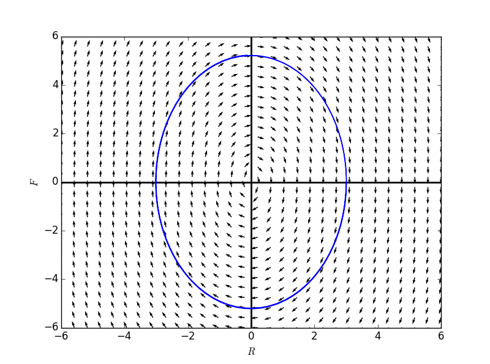
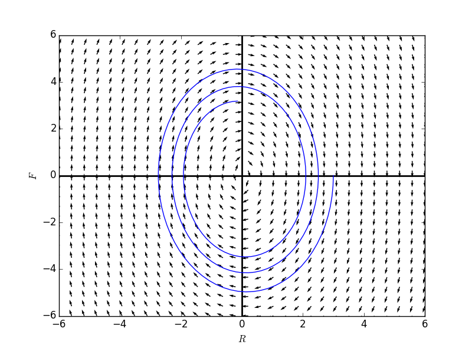
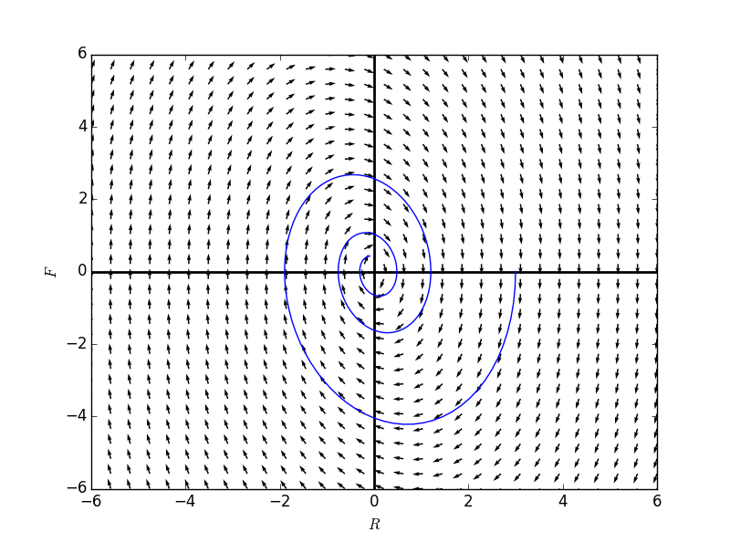
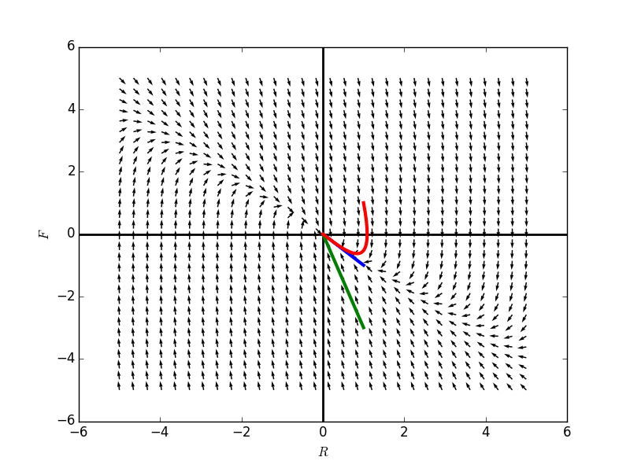

#**阻尼谐振(Damped Harmonic Oscillation)**   
为我们之前提到的弹簧-重物系统增加上阻力。

前提假设：
+ 阻力与重物的速度成正比: $$F_d = -b\frac{dy}{dt}, b > 0$$
+ 牛顿第二定律：$$F=ma$$
+ 胡克定律： $$F_s = -ky$$     

变量：
1. 自变量：$$t$$ 时间
2. 因变量：$$y$$ 位移

获得阻尼振动的方程为：
$$F_s + F_d = F = ma = m \frac{d^2y}{dt^2}\\
-ky -b\frac{dy}{dt} = m \frac{d^2y}{dt^2} \\
m\frac{d^2y}{dt^2} + b\frac{dy}{dt} +ky = 0$$

可以令$$v = \frac{dy}{dt}$$，将上面方程降为一个一阶方程组：
$$\begin{cases} \frac{dy}{dt} = v \ \frac{dv}{dt} = -\frac{k}{m}y - \frac{b}{m}v \end{cases}$$    

给定一个初始的位置$$y=3$$，令$$k,m$$不变，调节$$b$$值，看解的不同表现：

当$$b = 0$$时，没有阻力：
```
	R = Function('R')
	F = Function('F')

	formulaR = F(t)
	formulaF = -3*R(t)

	Rdomain = np.linspace(-6,6,30)
	Fdomain = np.linspace(-6,6,30)

	fg1 = directionField(formulaR, formulaF,Rdomain, Fdomain)
	Tvals,Rvals,Fvals = numericalApproxForTwo(formulaR, formulaF, 3.0, 0.0, dt = 0.0005, steps = 20000)
	plt.plot(Rvals, Fvals)
	fg1.show()
```


```
	R = Function('R')
	F = Function('F')

	formulaR = F(t)
	formulaF = -3*R(t) - 0.1*F(t)

	Rdomain = np.linspace(-6,6,30)
	Fdomain = np.linspace(-6,6,30)

	fg2 = directionField(formulaR, formulaF,Rdomain, Fdomain)
	Tvals,Rvals,Fvals = numericalApproxForTwo(formulaR, formulaF, 3.0, 0.0, dt = 0.0005, steps = 20000)
	plt.plot(Rvals, Fvals)
	fg2.show()
```


```
	R = Function('R')
	F = Function('F')

	formulaR = F(t)
	formulaF = -3*R(t) - 0.1*F(t)

	Rdomain = np.linspace(-6,6,30)
	Fdomain = np.linspace(-6,6,30)

	fg2 = directionField(formulaR, formulaF,Rdomain, Fdomain)
	Tvals,Rvals,Fvals = numericalApproxForTwo(formulaR, formulaF, 3.0, 0.0, dt = 0.0005, steps = 20000)
	plt.plot(Rvals, Fvals)
	fg2.show()
```


## 猜测阻尼振动的一般解
$$ m\frac{d^2y}{dt^2} + b\frac{dy}{dt} +ky = 0$$

猜测$$y(t) = e^{\lambda t}$$,其中$$\lambda$$是一个需要计算得出的常数。  

$$\frac{dy}{dt} = \lambda e^{\lambda t}$$    
$$\frac{d^2y}{dt^2} = {\lambda}^2 e^{\lambda t}$$	

带入方程获得：
$$m({\lambda}^2 e^{\lambda t}) + b(\lambda e^{\lambda t}) + k e^{\lambda t} = 0 \\
(m{\lambda}^2 + b\lambda +k) e^{\lambda t} = 0$$

左边是一个多项式乘以$$e^{\lambda t}$$，该多项式被称为**特征多项式(characteristic polynomial)**  

因为我们关注的是$$\lambda$$取值为多少能使得该多项式取值为$$0$$，因此又称$$m{\lambda}^2 + b\lambda +k = 0$$为特征方程。  

例子：$$m = 1,b = 3,k = 2$$   
$$\frac{d^2y}{dt^2} + 3\frac{dy}{dt} + 2y = 0$$
特征方程为：
$${\lambda}^2 + 3\lambda + 2 = 0$$
解为：
$$\begin{cases} \lambda = -2 \\ \lambda = -1 \end{cases}$$

因此获得原方程的两组解：
$$\begin{cases} y_1(t) = e^{-2t} \ v_1(t) = -2e^{-2t}\end{cases}$$

$$\begin{cases} y_2(t) = e^{-t} \ v_2(t) = -e^{-t}\end{cases}$$   

写成向量函数的形式为： 
$$Y_1(t) = \begin{pmatrix} e^{-2t} \ -2e^{-2t} \end{pmatrix}$$
对应初值为：
$$ Y_1(0) = \begin{pmatrix} 1 \ -2 \end{pmatrix}$$

$$Y_2(t) = \begin{pmatrix} e^{-t} \ -e^{-t} \end{pmatrix}$$
对应初值为：
$$ Y_2(0) = \begin{pmatrix} 1 \ -1 \end{pmatrix}$$

下图中，有两个解对应于上面这两个，是哪两个？
