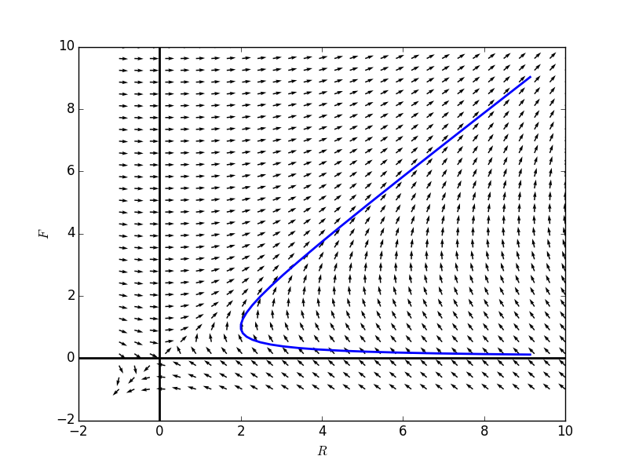
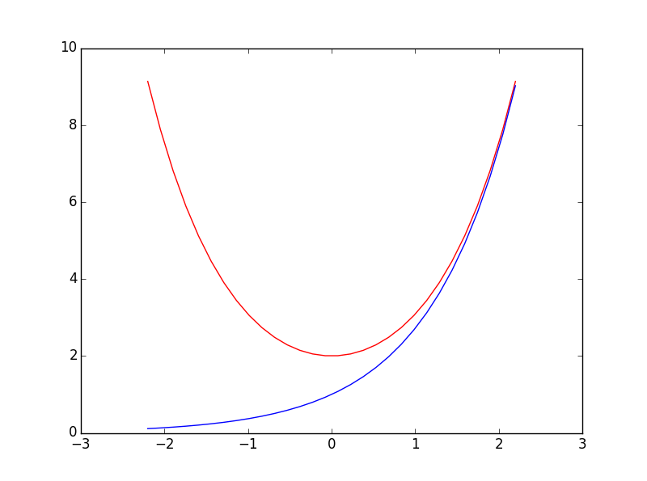

# 特殊方程组的分析解法
## 例子方程组
我们很少能用分析解法求解微分方程组，但还是有些是可解的。   

考虑如下方程组，和初值：
$$\begin{cases} \frac{dx}{dt} = 2y-x \\ \frac{dy}{dt} = y \end{cases}, \qquad (x_0, y_0) = (2,1) $$

其斜率场和解如下图：
```
    import numpy as np
    import sympy
    from sympy.abc import t
    from sympy import Function, Derivative, dsolve, Eq
    import matplotlib.pyplot as plt
        
    def directionField(fR, fF, Rdomain, Fdomain):
        fig = plt.figure(num=1)
        Rvals,Fvals = np.meshgrid(Rdomain,Fdomain)
        r = np.array([[fR.subs({'R(t)':rval, 'F(t)':fval}) for rval in Rdomain] for fval in Fdomain],dtype = 'float')
        f = np.array([[fF.subs({'R(t)':rval, 'F(t)':fval}) for rval in Rdomain] for fval in Fdomain],dtype = 'float')
        n = np.sqrt(r**2+f**2)
        r, f = r/n, f/n
        plt.quiver(Rvals, Fvals, r, f)
        plt.xlabel(r"$R$")
        plt.ylabel(r"$F$")
        plt.axhline(0,0,1,linewidth = 2, color = 'black')
        plt.axvline(0,0,1,linewidth = 2, color = 'black')
        return fig

    R = Function('R')
    F = Function('F')

    formulaR = 2*F(t) - R(t)
    formulaF = R(t)

    Rdomain = np.linspace(-1,10,30)
    Fdomain = np.linspace(-1,10,30)

    fg1 = directionField(formulaR, formulaF,Rdomain, Fdomain)
    tdomain = np.linspace(-2.2,2.2,30)
    Rvals = [exp(t) + exp(-1*t) for t in tdomain]
    Fvals = [exp(t) for t in tdomain]
    plt.plot(Rvals, Fvals, linewidth = 2)
    fg1.show()
```

    

其成分图为：
```
    fg2 = plt.figure()
    plt.plot(tdomain, Rvals, 'r', tdomain, Fvals, 'b')
    fg2.show()
```


注意到$$y(t)$$的成分图看上去像是一个指数函数，$$x(t)$$看上去像是一个抛物线。  

实际上，其解为：
$$Y(t) = \begin{pmatrix} e^t + e^{-t} \\ e^t \end{pmatrix} $$  
检验一下：
$$\frac{dY}{dt} = \begin{pmatrix} e^t -e^{-t}\\ e^t \end{pmatrix}$$  
$$F(Y(t)) = \begin{pmatrix} 2e^t - (e^t + e^{-t})\\ e^t \end{pmatrix} = \begin{pmatrix} e^t -e^{-t}\\ e^t \end{pmatrix}$$
并且$$Y(0) = \begin{pmatrix}  2\\1 \end{pmatrix}$$    

##**部分解耦方程组(Partially Decoupled Systems)**   
上面的例子中，注意到$$\frac{dy}{dt} = y$$并不包含$$x$$，我们知道该方程的一般解为：     
$$y(t)= y_0e^t$$    
将其带入到$$\frac{dx}{dt} = 2y - x$$中去：  
$$\frac{dy}{dt}  = 2y_0e^t -x $$   
得到一个非齐次的线性方程，我们可以用猜解法求解，也可以用积分因子来求解。    
下面用猜解法：
对应的齐次方程的一般解为 $$ke^{-t}$$ 
猜测$$x_p = \alpha e^t$$  
不难求出$$\alpha = y_0$$  
获得特殊解为:$$x_p = y_0e^t$$  
因此一般解为$$x(t) = y_0e^t + ke^{-t}$$    
将初值带入上式，可以求解出$$k = x_0 - y_0$$    

最后，获得方程组的一般解为：
$$Y(t) = \begin{pmatrix} y_0e^t + (x_0 - y_0)e^{-t}\\y_0e^t \end{pmatrix}$$


